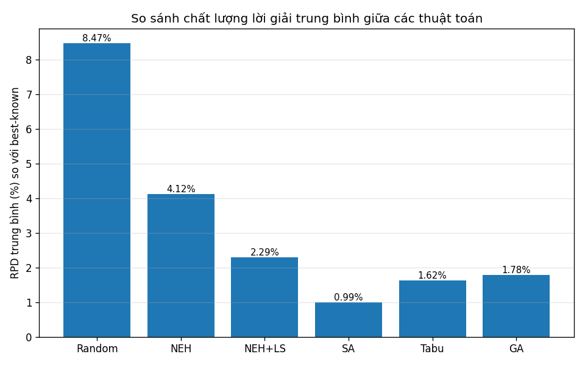
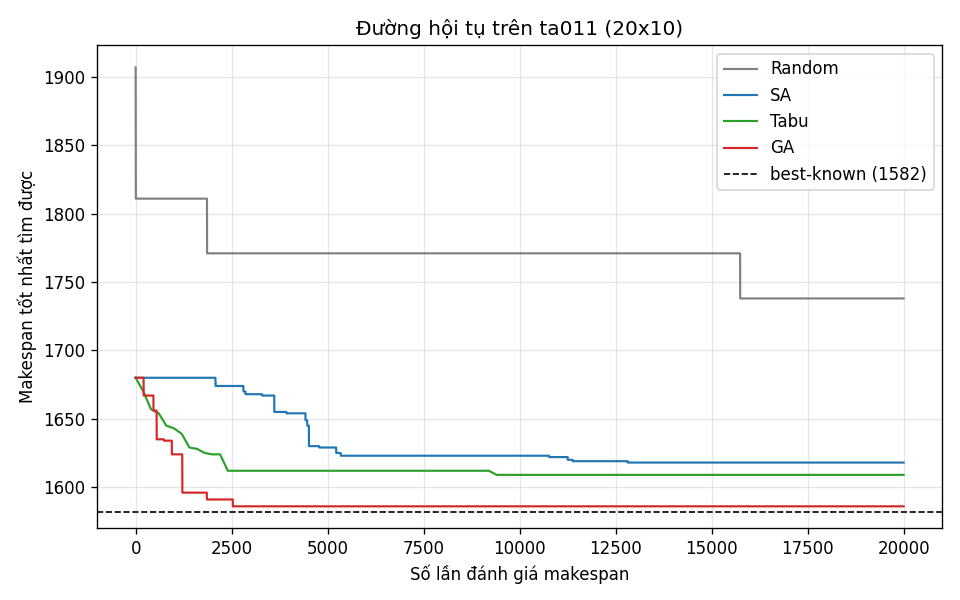
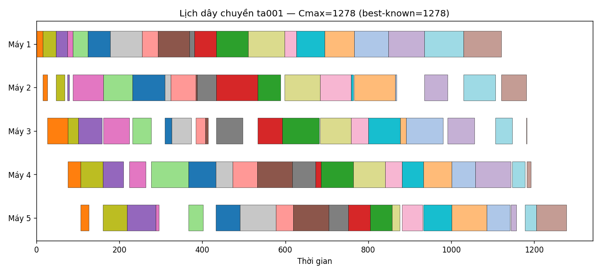

# Tìm hiểu và đánh giá các thuật toán cho bài toán tối ưu dây chuyền sản xuất

> Báo cáo kèm cài đặt chạy được. Toàn bộ mã nguồn trong thư mục `src/`, dữ liệu chuẩn
> Taillard được sinh tái lập, kết quả thực nghiệm trong `results/`.

---

## 1. Giới thiệu

### 1.1. Bài toán

Một **dây chuyền sản xuất** điển hình gồm nhiều **máy/công đoạn** nối tiếp. Mỗi
sản phẩm (job) phải lần lượt đi qua các máy theo cùng một thứ tự công đoạn
(M1 → M2 → … → Mm). Bài toán đặt ra: **xếp thứ tự đưa các sản phẩm vào dây chuyền**
sao cho tối ưu một chỉ tiêu sản xuất.

Mô hình toán học tương ứng là **Permutation Flow Shop Scheduling Problem (PFSP)**:

- Có `n` công việc và `m` máy.
- `p[j][i]` = thời gian xử lý công việc `j` trên máy `i`.
- Mọi máy xử lý các công việc theo **cùng một hoán vị** (permutation) π.
- Một máy chỉ làm một việc tại một thời điểm; một việc không thể ở hai máy cùng lúc;
  không gián đoạn (non-preemptive).

**Mục tiêu chính: tối thiểu hoá Makespan** `Cmax` — thời điểm sản phẩm cuối cùng
rời khỏi máy cuối cùng. Makespan nhỏ ⇒ dây chuyền thông suốt, năng suất cao, ít
tắc nghẽn.

Công thức thời điểm hoàn thành (completion time) cho hoán vị π = (π₁,…,πₙ):

```
C(π₁, 1) = p[π₁][1]
C(πₖ, 1) = C(πₖ₋₁, 1) + p[πₖ][1]
C(π₁, i) = C(π₁, i-1) + p[π₁][i]
C(πₖ, i) = max( C(πₖ₋₁, i), C(πₖ, i-1) ) + p[πₖ][i]
Cmax(π) = C(πₙ, m)
```

(cài đặt tại [src/flowshop.py](src/flowshop.py)).

### 1.2. Vì sao cần thuật toán tối ưu?

Số hoán vị khả dĩ là `n!`. Với chỉ 20 sản phẩm đã có `20! ≈ 2.4×10¹⁸` phương án —
không thể duyệt hết. Bài toán PFSP với `m ≥ 3` máy đã được chứng minh là **NP-hard**
(Garey, Johnson & Sethi, 1976). Do đó:

- Với quy mô nhỏ: dùng thuật toán **chính xác** (Branch & Bound, quy hoạch nguyên).
- Với quy mô thực tế: dùng **heuristic** (dựng hình nhanh) và **metaheuristic**
  (tìm kiếm thông minh) để có lời giải tốt trong thời gian chấp nhận được.

### 1.3. Phạm vi báo cáo

Báo cáo tìm hiểu và **đánh giá thực nghiệm** 6 phương pháp tiêu biểu, trải đủ các
nhóm thuật toán:

| Nhóm | Thuật toán | Vai trò |
|---|---|---|
| Baseline | **Random Search** | mốc so sánh dưới |
| Heuristic dựng hình | **NEH** | chuẩn vàng về tốc độ |
| Memetic | **NEH + Local Search** | dựng hình + tinh chỉnh cục bộ |
| Metaheuristic | **Simulated Annealing (SA)** | luyện kim mô phỏng |
| Metaheuristic | **Tabu Search** | tìm kiếm có trí nhớ |
| Metaheuristic tiến hoá | **Genetic Algorithm (GA)** | thuật toán di truyền |

---

## 2. Dữ liệu

### 2.1. Bộ benchmark Taillard

Sử dụng bộ dữ liệu **Taillard (1993)** — bộ benchmark kinh điển và được trích dẫn
nhiều nhất cho Flow Shop. Điểm đặc biệt: dữ liệu không lưu thành file mà được **sinh
lại** từ một bộ sinh số ngẫu nhiên xác định (Lehmer/MINSTD) cùng các "seed thời gian"
đã công bố. Nhờ vậy mọi nghiên cứu trên thế giới dùng đúng **cùng một dữ liệu** ⇒
kết quả có thể đối chiếu trực tiếp với tài liệu (cài đặt tại
[src/instances.py](src/instances.py)).

- Thời gian xử lý là số nguyên đều trong `[1, 99]`.
- Đã kiểm chứng ma trận sinh ra khớp chính xác dữ liệu Taillard công bố
  (ví dụ ta001, máy 1, job 1–10 = `54,83,15,71,77,36,53,38,27,87`).

### 2.2. Các instance dùng trong thực nghiệm

| Nhóm | Instance | Kích thước (job × máy) | Ghi chú |
|---|---|---|---|
| Dễ | ta001–ta010 | 20 × 5 | **đã biết lời giải tối ưu** |
| Khó hơn | ta011–ta020 | 20 × 10 | dùng best-known upper bound |

Việc nhóm 20×5 đã được giải tối ưu cho phép **đo chính xác** thuật toán còn cách
tối ưu bao xa, không chỉ so sánh tương đối với nhau.

### 2.3. Thước đo đánh giá

Dùng **RPD — Relative Percentage Deviation** so với lời giải tốt nhất đã biết:

```
RPD = 100 × (Cmax_thuật_toán − Cmax_best_known) / Cmax_best_known   (%)
```

RPD = 0% nghĩa là đạt tối ưu; RPD càng nhỏ càng tốt. Với thuật toán ngẫu nhiên,
mỗi instance chạy nhiều seed rồi báo cáo cả **trung bình** (độ ổn định) lẫn **tốt
nhất** (tiềm năng).

---

## 3. Các thuật toán

Mọi thuật toán dùng chung **lân cận insertion** (rút một job khỏi vị trí và chèn vào
vị trí khác) — loại lân cận tốt nhất đã được kiểm chứng cho Flow Shop. Cài đặt đầy đủ
tại [src/algorithms.py](src/algorithms.py).

### 3.1. Random Search (baseline)
Sinh ngẫu nhiên các hoán vị, giữ lời giải tốt nhất. Không "học" gì từ quá khứ; chỉ
dùng làm **mốc dưới** để thấy giá trị thực sự của các thuật toán thông minh.

### 3.2. NEH (Nawaz–Enscore–Ham, 1983)
Heuristic dựng hình nổi tiếng và hiệu quả nhất cho PFSP:

1. Sắp xếp các job theo **tổng thời gian xử lý giảm dần** (job "nặng" vào trước).
2. Lần lượt lấy từng job, thử **chèn vào mọi vị trí** của chuỗi đang dựng, giữ vị trí
   cho makespan nhỏ nhất.

Độ phức tạp `O(n²m)`, chạy gần như tức thì, thường chỉ cách tối ưu ~3–5%. Là **điểm
khởi tạo** cho hầu hết metaheuristic.

### 3.3. NEH + Local Search (memetic)
Lấy lời giải NEH rồi **tinh chỉnh cục bộ**: lặp lại việc thử chèn từng job sang vị trí
tốt nhất cho tới khi không cải thiện được nữa (hội tụ về cực tiểu cục bộ). Rẻ mà
thường cải thiện đáng kể NEH thuần.

### 3.4. Simulated Annealing — Luyện kim mô phỏng
Mô phỏng quá trình tôi luyện kim loại:

- Xuất phát từ NEH.
- Mỗi bước thử một nước đi insertion ngẫu nhiên; **chấp nhận nghiệm xấu hơn** với xác
  suất `exp(−Δ/T)` để thoát khỏi bẫy cực tiểu cục bộ.
- **Hạ nhiệt** dần `T ← α·T` (α=0.97); có **hâm nóng lại** (reheat) nhẹ khi quá nguội
  để tránh đóng băng sớm.

Ưu: đơn giản, ít tham số, thoát local optima tốt.

### 3.5. Tabu Search — Tìm kiếm có trí nhớ
- Luôn di chuyển đến **nước đi tốt nhất trong lân cận**, kể cả khi xấu đi.
- Dùng **danh sách cấm (tabu list)** ghi nhớ các nước đi gần đây để **không quay lại**
  vùng vừa rời, nhờ đó vượt qua cực tiểu cục bộ.
- **Aspiration**: vẫn cho phép một nước đi bị cấm nếu nó **phá kỷ lục** hiện tại.

Ưu: thường mạnh nhất nhóm trên Job/Flow Shop nhờ khai thác có định hướng.

### 3.6. Genetic Algorithm — Thuật toán di truyền
Mô phỏng tiến hoá quần thể:

- **Mã hoá**: mỗi cá thể là một hoán vị job. Quần thể được **gieo NEH** để xuất phát tốt.
- **Chọn lọc**: đấu loại (tournament) kích thước 2.
- **Lai ghép**: **Order Crossover (OX)** — chuẩn cho mã hoá hoán vị.
- **Đột biến**: insertion. Giữ lại **cá thể tinh hoa (elite)** qua các thế hệ.

Ưu: tìm kiếm song song nhiều vùng, tốt cho bài toán đa mục tiêu (mở rộng NSGA-II).

### 3.7. Cân bằng công bằng giữa các thuật toán
Tất cả metaheuristic chạy với **cùng ngân sách** = số lần đánh giá makespan như nhau
(20.000 evals). Đây là cách so sánh công bằng theo chuẩn nghiên cứu, vì chi phí thực
sự nằm ở số lần tính makespan chứ không phải thời gian treo máy.

---

## 4. Thực nghiệm

### 4.1. Thiết lập
- Benchmark: 20 instance Taillard (ta001–ta020), tổng 10 instance 20×5 và 10 instance 20×10.
- Ngân sách: **20.000** lần đánh giá makespan cho mỗi metaheuristic (so sánh công bằng).
- Lặp lại: **3 seed** cho mỗi thuật toán ngẫu nhiên, lấy trung bình & tốt nhất.
- Khởi tạo SA/Tabu/GA bằng NEH.
- Máy chạy: Python 3.12, tổng thời gian thực nghiệm ≈ 620 giây.

### 4.2. Kết quả tổng hợp toàn bộ benchmark

RPD = % lệch so với best-known (càng nhỏ càng tốt). `RPD_best` = lấy lần chạy tốt nhất
trong các seed; `RPD_mean` = trung bình các seed (độ ổn định); `RPD_max` = instance tệ
nhất; `t` = thời gian trung bình mỗi instance.

| Thuật toán | RPD_best | RPD_mean | RPD_max | t (giây) |
|---|---:|---:|---:|---:|
| Random   | 7.75% | 8.47% | 12.57% | 2.29 |
| NEH      | 4.12% | 4.12% | 7.66% | **0.016** |
| NEH+LS   | 2.29% | 2.29% | 4.72% | 0.14 |
| **SA**   | **0.68%** | **0.99%** | **2.00%** | 2.31 |
| Tabu     | 1.32% | 1.62% | 3.29% | 2.22 |
| GA       | 1.38% | 1.78% | 3.01% | 3.18 |

**Xếp hạng chất lượng:** SA > Tabu > GA > NEH+LS > NEH > Random.

### 4.3. Kết quả theo nhóm kích thước

Trên nhóm **20×5** (đã biết tối ưu), SA **đạt đúng tối ưu (RPD=0%)** ở 6/10 instance
(ta001, ta004, ta006, ta008, ta009, ta010) ở lần chạy tốt nhất. Trên nhóm **20×10**
khó hơn, khoảng cách của mọi thuật toán đều nới rộng — đúng quy luật makespan càng
nhiều máy càng khó tối ưu.

### 4.4. Biểu đồ

**So sánh RPD trung bình** (`results/avg_gap.png`):



**Đường hội tụ trên ta011, 20×10** (`results/convergence.png`) — trục x là số lần
đánh giá makespan, quy về cùng thang ngân sách cho mọi thuật toán:



**Lịch dây chuyền (Gantt) lời giải tối ưu ta001** (`results/gantt_ta001.png`) — mỗi
màu là một sản phẩm chảy qua 5 máy, Cmax=1278 đúng bằng tối ưu:



### 4.5. Nhận xét

1. **Giá trị của thuật toán thông minh là rõ ràng.** Random dừng ở 8.47% trong khi
   SA chỉ 0.99% — tức metaheuristic tốt giảm khoảng cách tới tối ưu **hơn 8 lần** với
   cùng ngân sách tính toán.

2. **NEH cực kỳ đáng giá về tốc độ.** Chỉ 0.016 giây đã cho lời giải 4.12% — gần như
   miễn phí. Đây là lý do mọi metaheuristic đều dùng NEH làm điểm khởi tạo.

3. **Tinh chỉnh cục bộ rẻ mà hiệu quả.** NEH+LS giảm gap từ 4.12% xuống 2.29% (gần
   một nửa) chỉ với 0.14 giây — tỉ lệ lợi ích/chi phí cao nhất nếu cần kết quả tức thì.

4. **SA thắng thuyết phục** cả về chất lượng trung bình lẫn độ ổn định (RPD_max chỉ
   2.00%, thấp nhất). Lân cận insertion + cơ chế reheat giúp nó khai thác sâu mà không
   đóng băng sớm. Trên đường hội tụ, SA tiếp tục cải thiện đều tới gần hết ngân sách.

5. **GA hội tụ nhanh nhưng dễ chững.** Đường đỏ trên đồ thị tụt rất nhanh trong ~2500
   eval đầu rồi gần như nằm ngang — dấu hiệu hội tụ sớm của quần thể; cần cơ chế đa
   dạng hoá (restart, đột biến mạnh hơn) để khai thác hết ngân sách.

6. **Đánh đổi thời gian/chất lượng:** nếu cần lời giải tức thì dùng **NEH/NEH+LS**;
   nếu có vài giây và cần chất lượng cao dùng **SA**.

### 4.6. Hạn chế và hướng mở rộng

- Quy mô thử nghiệm còn nhỏ (20 job); nên mở rộng tới các nhóm 50×20, 100×20 của
  Taillard để kiểm tra khả năng co giãn.
- Có thể bổ sung lời giải **chính xác** bằng CP-SAT (Google OR-Tools) để đối chiếu cận
  trên/cận dưới và đo gap tuyệt đối trên nhóm khó.
- Mục tiêu hiện tại là makespan đơn lẻ; thực tế sản xuất thường **đa mục tiêu**
  (makespan + trễ hạn + WIP) — mở rộng GA thành **NSGA-II** là hướng tự nhiên.
- GA cần được tinh chỉnh tham số (kích thước quần thể, tỉ lệ đột biến) hoặc lai với
  local search (memetic) để cạnh tranh với SA.

---

## 5. Cách chạy lại

```bash
cd src
python instances.py      # kiểm tra bộ sinh dữ liệu Taillard
python experiment.py     # chạy toàn bộ thực nghiệm, xuất results/
```

Yêu cầu: Python 3.10+, `numpy`, `matplotlib` (xem `requirements.txt`).

---

## 6. Tài liệu tham khảo
1. E. Taillard (1993). *Benchmarks for basic scheduling problems*. EJOR 64, 278–285.
2. M. Nawaz, E. Enscore, I. Ham (1983). *A heuristic algorithm for the m-machine,
   n-job flow-shop sequencing problem*. OMEGA 11(1), 91–95.
3. Garey, Johnson, Sethi (1976). *The complexity of flowshop and jobshop scheduling*.
   Mathematics of Operations Research 1(2), 117–129.
4. Nowicki, Smutnicki (1996). *A fast tabu search algorithm for the permutation
   flow-shop problem*. EJOR 91, 160–175.
